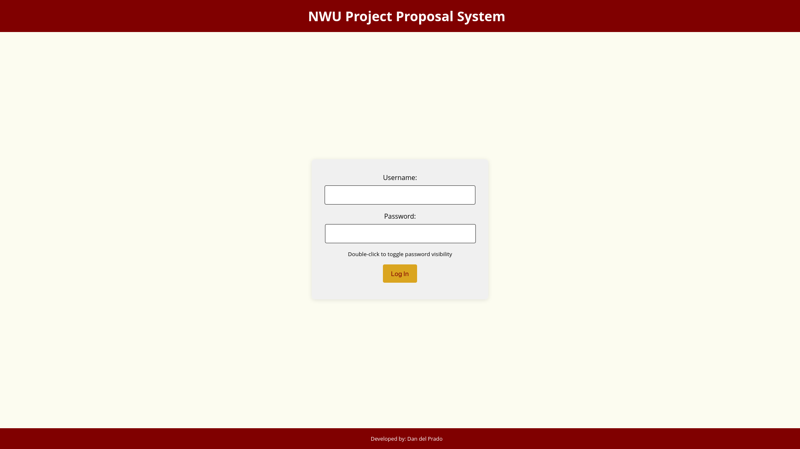

# NWU-PPS Project

NWU-PPS is a web-based application designed to streamline the submission, review, and approval process for project proposals within Northwestern University. The system features role-based access controls, ensuring that only authorized users can view and approve proposals.

## Table of Contents
- [Features](#features)
  - [User Authentication](#user-authentication)
  - [Dashboard](#dashboard)
  - [Proposals](#proposals)
- [Database Setup](#database-setup)
- [Screenshots](#screenshots)

## Features

### User Authentication
- **Login**
  - Users can log in to the system using their username and password.
  - Password visibility toggle available for convenience.

- **Change Password**
  - Users must change their initial password upon first login.
  - Enforces password strength rules.

- **Update Profile**
  - Users need to complete their profile information after changing the password.

### Dashboard
- **User Dashboard**
  - Displays a welcome message with the user’s first name.
  - Provides links to submit new proposals, view existing proposals, update personal info, and change password.

- **Approver Dashboard**
  - Displays a welcome message with the approver’s first name.
  - Provides links to view proposals for approval, update personal info, and change password.

### Proposals
- **Submit Proposal**
  - Users can submit new proposals with relevant details and upload necessary documents.
  - Options to request funding or facilities.

- **View Proposals**
  - Users can view all their submitted proposals and their current status.
  - Approvers can see the proposals awaiting their approval and take action.

## Database Setup

### Database Type
This project uses SQLite for the database.

### Database Schema

- **Colleges**
  - **Purpose**: Stores information about colleges including the dean responsible.
  - **Columns**:
    - `CollegeID`: Primary key, unique identifier for each college.
    - `Name`: The name of the college.
    - `DeanUserID`: Foreign key referencing the user who is the dean of the college.

- **Notifications**
  - **Purpose**: Stores notification messages for users, indicating unread notifications.
  - **Columns**:
    - `NotificationID`: Primary key, unique identifier for each notification.
    - `UserID`: Foreign key referencing the user who receives the notification.
    - `Message`: The content of the notification.
    - `Timestamp`: The time the notification was created.
    - `IsRead`: Boolean indicating whether the notification has been read.

- **Proposals**
  - **Purpose**: Stores project proposals with details such as title, submission date, status, and associated user IDs for tracking the proposal's progress.
  - **Columns**:
    - `ProposalID`: Primary key, unique identifier for each proposal.
    - `Title`: The title of the proposal.
    - `SubmittedByUserID`: Foreign key referencing the user who submitted the proposal.
    - `Status`: The current status of the proposal (e.g., pending, approved, rejected).
    - `SubmissionDate`: The date the proposal was submitted.
    - `LastUpdatedDate`: The date the proposal was last updated.
    - `DocumentPath`: Path to the document associated with the proposal.
    - `FundingRequired`: Boolean indicating whether funding is required.
    - `FacilityRequired`: Boolean indicating whether facilities are required.
    - `CurrentApproverUserID`: Foreign key referencing the current approver of the proposal.
    - `NextApproverUserID`: Foreign key referencing the next approver of the proposal.
    - `RevisionRequired`: Boolean indicating whether a revision is required.
    - `RevisionComment`: Comment on why a revision is required.

- **Roles**
  - **Purpose**: Defines different user roles within the system, such as student, approver, and admin.
  - **Columns**:
    - `RoleID`: Primary key, unique identifier for each role.
    - `Title`: The title of the role.
    - `Description`: A brief description of the role.

- **Departments**
  - **Purpose**: Stores information about departments within the colleges.
  - **Columns**:
    - `DepartmentID`: Primary key, unique identifier for each department.
    - `Name`: The name of the department.
    - `CollegeID`: Foreign key referencing the college the department belongs to.

- **Organizations**
  - **Purpose**: Stores information about organizations and their associations with colleges and departments.
  - **Columns**:
    - `OrganizationID`: Primary key, unique identifier for each organization.
    - `Name`: The name of the organization.
    - `CollegeID`: Foreign key referencing the college the organization belongs to.
    - `DepartmentID`: Foreign key referencing the department the organization belongs to.

- **ProposalsLog**
  - **Purpose**: Logs actions and comments on proposals for audit and review purposes.
  - **Columns**:
    - `LogID`: Primary key, unique identifier for each log entry.
    - `ProposalID`: Foreign key referencing the proposal the log entry is associated with.
    - `UserID`: Foreign key referencing the user who made the log entry.
    - `Comment`: The content of the log entry.
    - `Timestamp`: The time the log entry was created.

- **Users**
  - **Purpose**: Stores user information including authentication details and role assignments.
  - **Columns**:
    - `UserID`: Primary key, unique identifier for each user.
    - `Username`: The username of the user, unique.
    - `Password`: The password of the user, hashed.
    - `FirstName`: The first name of the user.
    - `LastName`: The last name of the user.
    - `RoleID`: Foreign key referencing the role assigned to the user.
    - `OrganizationID`: Foreign key referencing the organization the user belongs to.
    - `PasswordChanged`: Boolean indicating whether the user has changed their initial password.
    - `InfoCompleted`: Boolean indicating whether the user has completed their profile information.

## Screenshots

